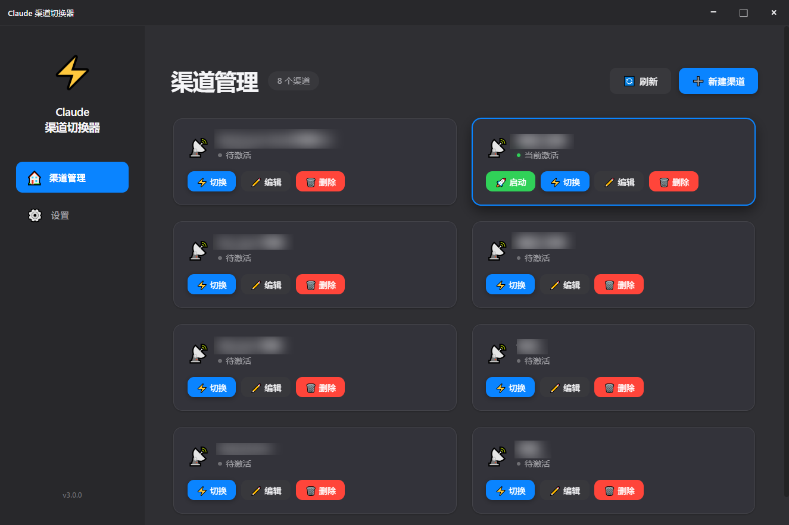
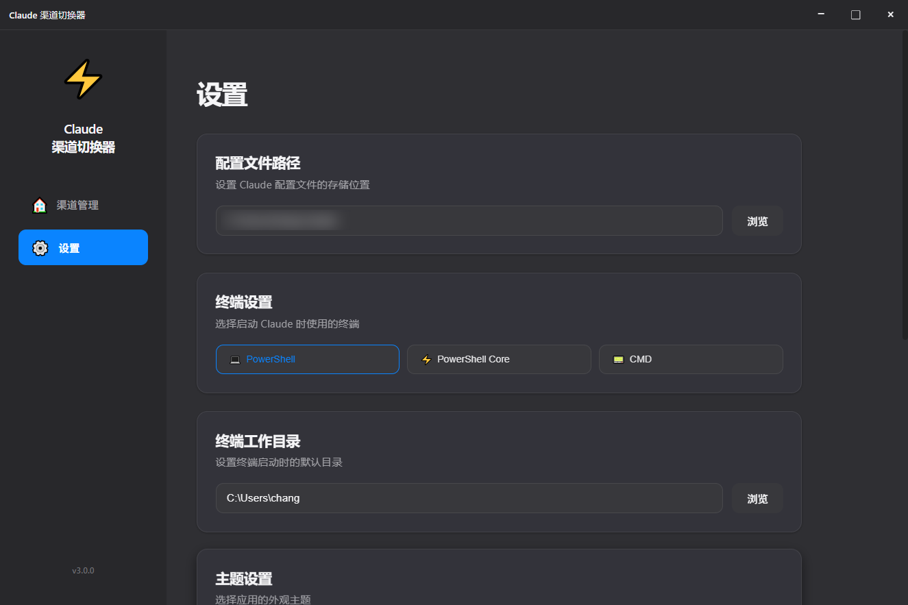
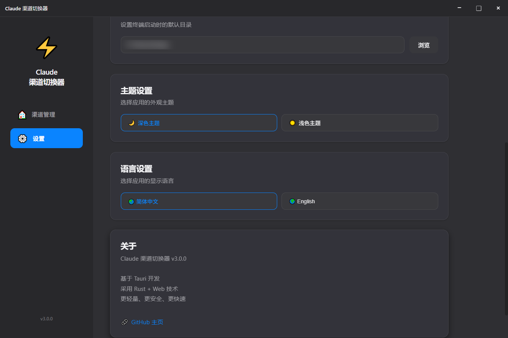
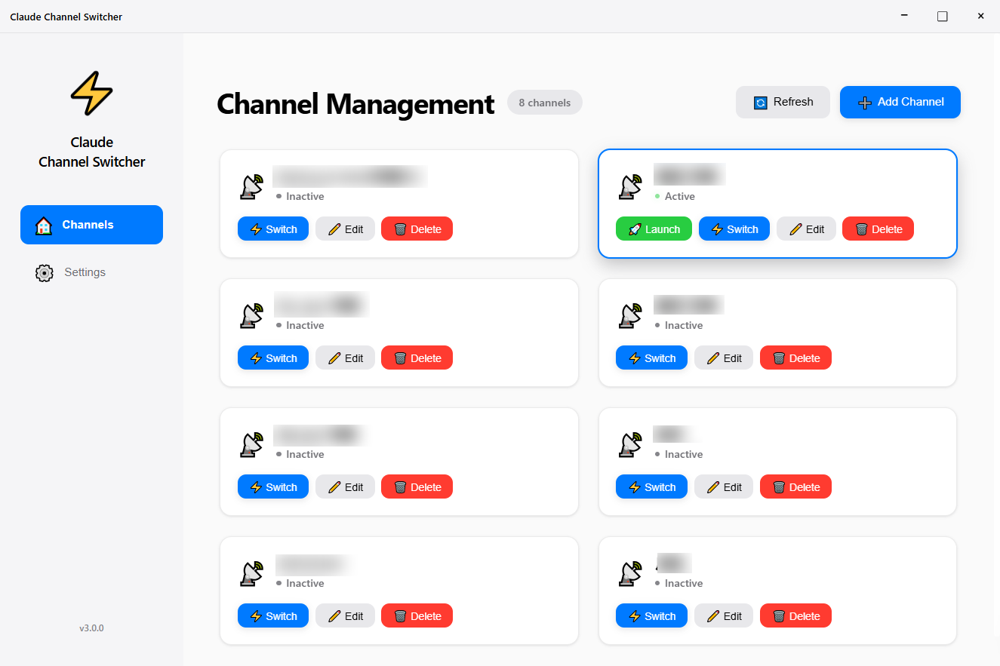

# Claude 渠道切换器

一个现代化的 Claude API 渠道管理工具，提供流畅的渠道切换体验。

## ⚠️ 重要提示

> **推荐使用 Tauri 版本**：Tauri 版本是最新维护的版本，功能最全，打包后的 exe 仅约 5MB。
> 
> **自行打包**：如需自行打包，请打包 `tauri-app/` 目录下的 Tauri 版本。
> 
> **Release 说明**：GitHub Release 中的 exe 文件不一定是最新版本，建议自行拉取代码打包以获取最新功能。

### 快速打包指南

```bash
# 1. 克隆项目
git clone https://github.com/changingshow/claude-channel-switcher.git
cd claude-channel-switcher/tauri-app

# 2. 安装依赖
npm install

# 3. 打包（生成安装包在 src-tauri/target/release/bundle/ 目录）
npm run build
```

**前置要求**：
- [Rust](https://www.rust-lang.org/tools/install) 1.70+
- [Node.js](https://nodejs.org/) 18+

## 🆕 最新更新 (v3.1.0)

> **注意**：本次更新仅针对 **Tauri 版本**，建议使用 Tauri 版本，打包后的 exe 仅约 5MB，远小于 Electron 版本的 150MB。

### 新增功能：余额查询
- 支持为每个渠道配置余额查询 API
- 在渠道卡片右上角显示余额按钮，点击即可查询
- 灵活配置：
  - **查询地址**：支持 `{apikey}` 占位符自动替换 Token
  - **查询方法**：支持 GET / POST
  - **余额字段**：支持嵌套路径（如 `data.balance`），自动递归查找

### UI 优化
- 编辑按钮换用新配色，与卡片背景区分更明显

## 📸 截图展示




*主界面 - 渠道管理*



*渠道管理页面*



*设置页面*



*浅色主题*


## 📦 两个版本

本项目提供两个版本，功能相同，技术栈不同：

### Electron 版本
- **技术栈**: Electron + JavaScript
- **目录**: 项目根目录
- **特点**: 成熟稳定，生态丰富

### Tauri 版本
- **技术栈**: Tauri v2 + Rust + JavaScript
- **目录**: `tauri-app/`
- **特点**: 更轻量、更安全、更快速（安装包 ~5MB vs ~150MB）

## ✨ 核心功能

- 🎨 现代化的玻璃态设计
- 🌊 流畅的动画效果
- 📱 响应式布局
- 🚀 快速渠道切换
- 🤖 Droid 渠道管理（Factory Droid API Key 管理）
- ⚙️ 自定义终端配置
- 💾 本地配置存储
- 🌓 深色/浅色主题
- 🌍 多语言支持（中文/英文）

## 🚀 快速开始

### Electron 版本

```bash
# 安装依赖
npm install

# 启动应用
npm start

# 构建应用
npm run build
```

### Tauri 版本

```bash
# 进入 Tauri 目录
cd tauri-app

# 安装依赖
npm install

# 启动开发模式
npm run dev

# 构建安装包
npm run build
```

**前置要求（Tauri 版本）**:
- Rust 1.70+ ([下载安装](https://www.rust-lang.org/tools/install))
- Node.js 18+ ([下载安装](https://nodejs.org/))
- WebView2 (Windows 10/11 通常已预装)

## 📖 使用说明

### 渠道管理
1. 点击「新建渠道」按钮
2. 输入渠道名称、API Token 和 Base URL
3. 点击「保存」

### 切换渠道
1. 在渠道列表中找到目标渠道
2. 点击「切换」按钮
3. 当前激活的渠道会显示绿色状态指示器

### 启动 Claude
1. 在激活的渠道卡片上点击「启动」按钮
2. 会在新的终端窗口中启动 Claude

### Droid 渠道管理
管理 Factory Droid 的 API Key，支持多渠道切换。

1. 点击左侧导航栏的「Droid 渠道」
2. 点击「新建渠道」添加 Droid 渠道
3. 输入渠道名称和 API Key（格式：`fx-xxxxx...`）
4. 点击「切换」设置当前使用的 API Key
5. 在激活的渠道上点击「启动」在终端中运行 droid

**工作原理**：
- 切换渠道时自动设置 `FACTORY_API_KEY` 环境变量
- 环境变量同时写入系统（Windows 注册表），新终端可直接使用
- 启动时会在配置的终端中运行 `droid` 命令

**配置文件**：
- Droid 渠道存储在 `~/.claude/key.txt` 文件中
- 格式：每行一个渠道，`渠道名称 API_KEY`

### 设置
1. 点击左侧导航栏的「设置」
2. 可以修改：
   - 配置文件路径
   - 启动终端类型
   - 终端工作目录
   - 主题（深色/浅色）
   - 语言（中文/英文）

## 📊 版本对比

| 指标 | Tauri 版 | Electron 版 |
|------|---------|------------|
| **安装包大小** | ~5MB | ~150MB |
| **内存占用** | ~30-50MB | ~150-200MB |
| **启动时间** | < 1秒 | 2-3秒 |
| **CPU 占用** | 低 | 中等 |
| **安全性** | 高（Rust） | 一般 |

## 🛠 技术栈

### Electron 版本
- **Electron** - 跨平台桌面应用框架
- **原生 JavaScript** - 无需额外框架
- **CSS3** - 现代化样式和动画

### Tauri 版本
- **Tauri v2** - 跨平台桌面应用框架
- **Rust** - 系统编程，内存安全
- **JavaScript** - 前端逻辑
- **CSS3** - 现代化样式和动画

## 📝 项目结构

```
electron-app/
├── src/                    # Electron 版本前端代码
│   ├── index.html
│   ├── app.js
│   ├── styles.css
│   └── i18n.js
├── main.js                 # Electron 主进程
├── package.json
│
└── tauri-app/              # Tauri 版本
    ├── src/                # 前端代码
    │   ├── index.html
    │   ├── js/
    │   ├── styles.css
    │   └── i18n.js
    ├── src-tauri/          # Rust 后端
    │   ├── src/main.rs
    │   ├── Cargo.toml
    │   └── tauri.conf.json
    └── package.json
```

## 🔗 相关链接

- **GitHub 主页**: [https://github.com/changingshow/claude-channel-switcher](https://github.com/changingshow/claude-channel-switcher)

## 📄 许可证

MIT License

---

**享受你的现代化 Claude 渠道切换体验！** ✨
