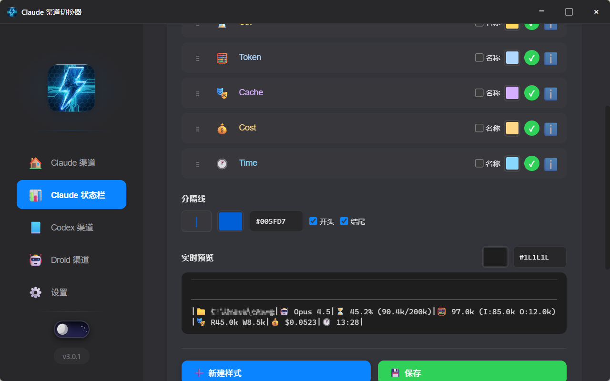
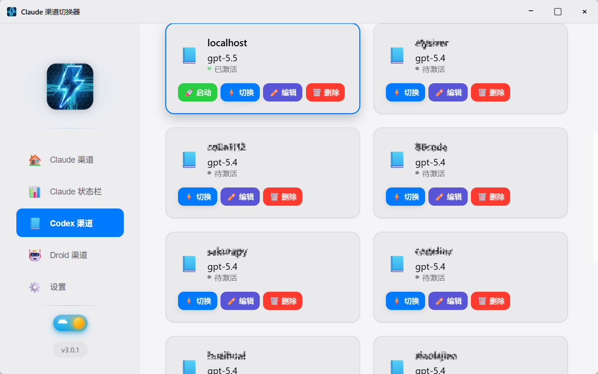

# Claude 渠道切换器

Claude 渠道切换器的 Tauri 版本，用于管理 Claude、Codex 和 Droid 的 API 渠道配置，并快速切换当前使用的渠道。

本工具是一个本地配置切换器，不代理请求，也不接管 CLI 的运行过程。它负责维护多套 Claude、Codex 和 Droid 渠道配置，并在切换时把选中的配置写回对应工具实际读取的位置。

## 实现逻辑

### Claude 渠道

Claude 渠道保存在 Claude 配置目录下的 `settings-<渠道名>.json`。切换时，程序把选中渠道的 `env`、`model`、`balanceApi` 合并写入 `settings.json`，并保留 `settings.json` 中其他配置。当前激活渠道通过对比 `settings.json` 中的 Token 和 Base URL 判断。

### Codex 渠道

Codex 渠道保存在 Codex 配置目录下的 `channels.json`。切换时，程序更新 `config.toml` 中的模型和 Base URL，并更新 `auth.json` 中的 `OPENAI_API_KEY`。当前激活渠道通过对比 `auth.json` 中的 API Key 判断。

### Droid 渠道

Droid 渠道保存在 Claude 配置目录下的 `key.txt`，每行一个渠道：

```text
渠道名 api_key
```

切换时，程序把选中渠道的 Key 写入 `FACTORY_API_KEY` 环境变量；在 Windows 上会同步写入用户级环境变量，方便新终端读取。当前激活渠道通过对比 `FACTORY_API_KEY` 判断。

## 功能

- Claude API 渠道管理和快速切换
- Codex 渠道管理
- Droid API Key 管理
- Claude StatusLine 可视化配置
- 渠道余额查询配置
- 深色/浅色主题
- 中文/英文界面
- 本地配置存储

## 界面截图

<table>
  <tr>
    <td align="center" width="50%">
      
    </td>
    <td align="center" width="50%">
      
    </td>
  </tr>
  <tr>
    <td align="center" width="50%">
      
    </td>
    <td align="center" width="50%">
      
    </td>
  </tr>
</table>

## 环境要求

- Node.js 18+
- Rust 1.70+
- Windows 10/11 WebView2 运行时

## 开发

```bash
npm install
npm run dev
```

## 构建

```bash
npm run build
```

Windows 安装包会生成在 `src-tauri/target/release/bundle/` 目录下。

## 常用命令

```bash
npm run tauri
npm run dev
npm run build
```

## 项目结构

```text
tauri-app/
├── src/                 # 前端代码
│   ├── index.html
│   ├── app.js
│   ├── i18n.js
│   ├── styles.css
│   ├── assets/
│   └── js/
├── src-tauri/           # Tauri/Rust 后端
│   ├── src/
│   ├── capabilities/
│   ├── icons/
│   ├── Cargo.toml
│   └── tauri.conf.json
├── package.json
└── package-lock.json
```

## 配置说明

- Tauri 前端目录：`src/`
- Tauri 配置文件：`src-tauri/tauri.conf.json`
- Rust 后端入口：`src-tauri/src/main.rs`
- 应用窗口使用自定义标题栏，Tauri 配置中关闭了系统装饰栏

## 许可证

MIT License
